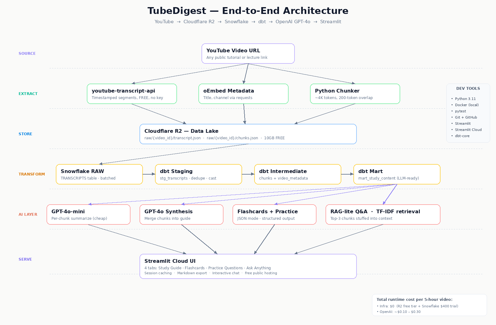
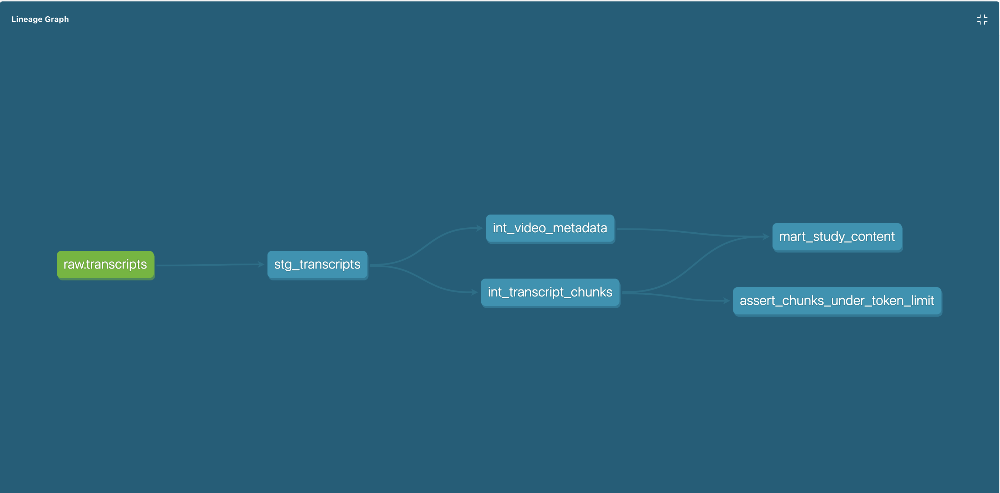

# 🎬 TubeDigest

> **Turn hours of YouTube tutorials into interview-ready study guides in minutes.**

[](https://www.python.org/)
[](https://streamlit.io/)
[](https://www.snowflake.com/)
[](https://www.getdbt.com/)
[](https://www.cloudflare.com/developer-platform/r2/)
[](https://openai.com/)
[](https://www.docker.com/)
[](https://pytest.org/)

TubeDigest is an end-to-end AI-powered data pipeline that extracts transcripts from YouTube videos, processes them through a Cloudflare R2 → Snowflake → dbt lakehouse, and uses OpenAI GPT-4o to generate structured study guides, flashcards, practice questions, and an interactive Q&A. Built end-to-end in under 3 days as an interview-prep accelerator.

**🔗 Live demo:** [tube-digest.streamlit.app](https://tube-digest-a9vromvkp57hpbe3czwuv7.streamlit.app/)
**📦 Repo:** [github.com/keshiarun01/tube-digest](https://github.com/keshiarun01/tube-digest)

---

## 🏗️ Architecture



The pipeline follows a classic **medallion architecture** — raw data lands untouched in the lake, gets cleaned and typed in staging, restructured in intermediate, and served as analysis-ready marts. Every stage is idempotent, tested, and observable.

---

## 🎯 Problem Statement

Technical interview prep often means sitting through 5–7 hour YouTube tutorials on SQL, Python, and Data Engineering concepts. There's no efficient way to extract the core concepts, code examples, and likely interview questions from hours of video content. TubeDigest solves this by compressing any tutorial into a structured study guide with flashcards and practice questions — ready in minutes, at a cost of around $0.20 per video.

---

## 🛠️ Tech Stack

**Language & Runtime**


**Data Ingestion**


**Cloud Storage & Warehouse**


**Transformation**


**AI / LLM**


**UI & Deployment**


**Testing**


### Responsibilities by layer

| Layer | Technology | Purpose |
|-------|-----------|---------|
| **Extraction** | `youtube-transcript-api`, `requests` | Pull timestamped transcripts + oEmbed metadata (zero API keys needed) |
| **Storage** | Cloudflare R2 (S3-compatible via boto3) | Raw data lake, 10 GB free tier, zero egress fees |
| **Warehouse** | Snowflake | Analytical warehouse, free $400 trial credits |
| **Transformation** | dbt-core + dbt-snowflake | Medallion pattern: staging → intermediate → marts with full test coverage |
| **LLM** | OpenAI GPT-4o + GPT-4o-mini | Tiered model strategy — cheap model per-chunk, flagship for synthesis |
| **Retrieval** | `scikit-learn` TF-IDF + cosine similarity | Lightweight RAG for the "Ask Anything" chat |
| **UI** | Streamlit + `streamlit-player` | Four-tab interactive study interface |
| **Infra** | Docker (local dev), Streamlit Cloud (deploy) | One-click deploy from GitHub |
| **Testing** | pytest + pytest-mock | Unit tests for every module with 100% of external I/O mocked |

---

## 🗂️ Project Structure

```
tube-digest/
├── app.py                         # Streamlit entry point (4 tabs + sidebar)
├── utils/
│   ├── transcript.py              # YouTube extraction + chunking
│   ├── r2.py                      # Cloudflare R2 S3-compatible helpers
│   ├── snowflake_loader.py        # Batched inserts with idempotency checks
│   ├── summarizer.py              # OpenAI orchestration + RAG-lite Q&A
│   └── pipeline.py                # End-to-end orchestrator called by UI
├── dbt_project/
│   ├── dbt_project.yml
│   ├── profiles/profiles.yml      # Env-var-based Snowflake connection
│   ├── models/
│   │   ├── staging/stg_transcripts.sql
│   │   ├── intermediate/
│   │   │   ├── int_transcript_chunks.sql
│   │   │   └── int_video_metadata.sql
│   │   └── marts/mart_study_content.sql
│   ├── tests/assert_chunks_under_token_limit.sql
│   └── macros/generate_schema_name.sql
├── prompts/
│   ├── summarize.txt              # Per-chunk study-note generator
│   ├── synthesize.txt             # Multi-chunk merger prompt
│   ├── flashcards.txt             # JSON-mode flashcard prompt
│   └── practice.txt               # MCQ + free-response prompt
├── tests/
│   ├── test_transcript.py
│   ├── test_r2.py
│   ├── test_snowflake.py
│   ├── test_summarizer.py
│   └── test_pipeline.py
├── assets/
│   ├── style.css                  # Custom Streamlit CSS
│   └── architecture.png
├── Dockerfile
├── docker-compose.yml
├── requirements.txt
├── .env.example
└── README.md
```

---

## 🔑 Key Concepts & Methods

### 1. Configuration-Driven Ingestion
Every secret — R2 keys, Snowflake credentials, OpenAI key — loads from environment variables via `python-dotenv`. Nothing is hardcoded; the same code runs locally, in Docker, and on Streamlit Cloud just by swapping the `.env` file.

### 2. Medallion Architecture (Bronze → Silver → Gold)
Raw JSON lands in Cloudflare R2 untouched (bronze). Snowflake's `RAW.TRANSCRIPTS` stores it as plain strings to keep ingestion fast. dbt's staging layer (silver) parses, deduplicates, and types the data. Intermediate models chunk segments into LLM-ready blocks and denormalize metadata. The final mart (`mart_study_content`) is a single table optimized for the OpenAI layer.

### 3. Idempotent Pipeline Stages
Every stage checks for existing work before doing it again. R2 uploads skip if the object exists. Snowflake inserts skip if rows for that `video_id` are already present. dbt's `materialized='view'` means staging re-runs are free; `materialized='table'` for the mart gives fast LLM reads. Re-processing the same video costs $0 for infra and only the OpenAI fee.

### 4. Token-Bounded Chunking at the SQL Layer
Chunking happens **inside dbt** using Snowflake's window functions (`SUM() OVER (PARTITION BY video_id ORDER BY segment_index)`) rather than in Python. This is faster, versioned, testable, and keeps transformation logic where it belongs.

### 5. Tiered LLM Strategy
Per-chunk summarization uses the cheaper **GPT-4o-mini** (~$0.15/1M input tokens). The final synthesis, flashcard generation, and practice-question generation use **GPT-4o** (~$2.50/1M input tokens) for higher quality. This cuts cost by ~5× vs using the flagship for everything without sacrificing quality where it matters.

### 6. RAG-lite Q&A with TF-IDF
The "Ask Anything" tab uses `TfidfVectorizer` + cosine similarity to find the top-3 most relevant chunks for any user question, then stuffs those into the GPT-4o prompt as context. No vector DB, no embedding API calls, no infrastructure. Works surprisingly well for tutorial content.

### 7. Defensive LLM Output Parsing
LLMs occasionally wrap JSON in markdown fences or nest it inside unexpected keys. The `safe_parse_json()` helper strips fences, handles single-key-wrapped arrays, and returns an empty list on failure — so a malformed response degrades gracefully instead of crashing the UI.

### 8. Resilient `dbt build` Integration
A known protobuf-versioning bug in dbt-core fires a `MessageToJson()` error *after* all models and tests pass successfully. The pipeline detects this specific signature and treats the run as a success when evidence shows `PASS=N ERROR=0`, rather than failing the user-facing flow on a telemetry bug.

### 9. Session-Scoped Caching
Streamlit's `st.session_state` caches the full pipeline output keyed by `video_id`, so tab switches, filter changes, and Q&A messages never re-hit the LLM. Chat history persists within the session but resets on page reload — a deliberate privacy choice.

---

## 📊 Data Lineage

The full dbt lineage graph generated via `dbt docs serve`:



This shows the dependency flow from the `raw.transcripts` source through staging, intermediate, and final mart models. Every edge is a `ref()` or `source()` call in a dbt model — dbt automatically builds models in dependency order.

---

## 🚀 Getting Started

### Prerequisites
- Python 3.11+
- A Cloudflare account (for R2)
- A Snowflake account ($400 free trial covers this project many times over)
- An OpenAI API key

### Local Setup

```bash
# 1. Clone the repo
git clone https://github.com/keshiarun01/tube-digest.git
cd tube-digest

# 2. Create a Python 3.11 virtual environment
python3.11 -m venv venv
source venv/bin/activate

# 3. Install dependencies
pip install -r requirements.txt

# 4. Copy the environment template and fill in your credentials
cp .env.example .env
# Then edit .env with your R2, Snowflake, and OpenAI keys

# 5. Create the Snowflake database + schemas
# Run the SQL from /sql/setup.sql in the Snowflake UI

# 6. Run the tests to verify everything is wired up
./venv/bin/python -m pytest tests/ -v

# 7. Launch the app
streamlit run app.py
```

### Docker Setup (alternative)

```bash
cp .env.example .env   # fill in credentials
docker compose up --build
# App available at http://localhost:8501
```

---

## 🔐 Required Environment Variables

```env
# Cloudflare R2
R2_ACCOUNT_ID=your_account_id
R2_ACCESS_KEY_ID=your_access_key
R2_SECRET_ACCESS_KEY=your_secret_key
R2_BUCKET_NAME=tube-digest-data

# Snowflake
SNOWFLAKE_ACCOUNT=your_account_identifier
SNOWFLAKE_USER=your_username
SNOWFLAKE_PASSWORD=your_password
SNOWFLAKE_WAREHOUSE=COMPUTE_WH
SNOWFLAKE_DATABASE=TUBE_DIGEST
SNOWFLAKE_SCHEMA=RAW
SNOWFLAKE_ROLE=ACCOUNTADMIN

# OpenAI
OPENAI_API_KEY=sk-proj-...
OPENAI_MODEL=gpt-4o
OPENAI_MODEL_CHEAP=gpt-4o-mini
```

---

## 💰 Cost Breakdown

| Service | Plan | Cost |
|---------|------|------|
| Cloudflare R2 | Free tier | $0 — 10 GB storage, unlimited egress |
| Snowflake | Trial credits | ~$2–5 of $400 across the whole project |
| OpenAI GPT-4o | Pay-per-token | ~$0.10 – $0.30 per 5-hour video |
| Streamlit Cloud | Free (public repo) | $0 |
| Docker / GitHub | Free | $0 |

**Total cost to run the project in production: effectively $0 on infrastructure.** Only OpenAI tokens are metered, and a typical 5-hour video lands at around 20 cents.

---

## 🧪 Testing

Every module has a corresponding test file with all external I/O mocked (no real API calls during unit tests):

```bash
./venv/bin/python -m pytest tests/ -v
```

Additionally, smoke tests (excluded from git via `.gitignore`) verify each phase end-to-end against real services:
- `smoke_test.py` — transcript extraction
- `smoke_test_r2.py` — R2 upload/download round-trip
- `smoke_test_snowflake.py` — R2 → Snowflake loading
- `smoke_test_summarizer.py` — full LLM pipeline

dbt tests run automatically as part of `dbt build`:
- `not_null` on all ID columns
- `unique` on `chunk_key` in the final mart
- `relationships` test validating foreign keys
- Singular SQL test ensuring no chunk exceeds the token budget by more than 20%

---

## 🏗️ Build Journey

The project was built in 8 sequential phases, each with its own set of unit tests and a smoke test that hits real services:

| Phase | Deliverable | Key Lesson |
|-------|-------------|------------|
| **0** | Project scaffolding + Docker | Python 3.11 pinned early to avoid dependency resolution hell |
| **1** | YouTube transcript extraction | `youtube-transcript-api` v1.x changed from class methods to instance methods — defensive version checks pay off |
| **2** | Unit tests + smoke test passing | Mocking `boto3` requires patching at the import site, not the source |
| **3** | Cloudflare R2 storage | R2 is S3-compatible — only the `endpoint_url` parameter changes vs boto3 against AWS |
| **4** | Snowflake ingestion | Snowflake's `executemany()` has a known bug rewriting `INSERT ... SELECT PARSE_JSON()` — solved by moving JSON parsing to dbt staging (better architecture anyway) |
| **5** | dbt models + lineage | Custom `generate_schema_name` macro prevents the default schema prefixing Snowflake does — gives clean `STAGING` and `ANALYTICS` schema names |
| **6** | OpenAI LLM layer | Tiered model strategy (cheap for chunks, flagship for synthesis) cut per-video cost by ~5× |
| **7** | Streamlit UI | `st.session_state` caching is critical — without it, every tab switch re-runs the $0.20 LLM pipeline |
| **8** | Streamlit Cloud deploy | `dbt` CLI isn't available on the cloud container — bundled `profiles.yml` + `--profiles-dir` flag fixes it |

---

## 🎓 What This Project Demonstrates

Built to showcase data engineering fundamentals for roles that value:

- **Modern lakehouse architecture** — object storage + cloud warehouse + version-controlled transformations
- **Medallion pattern** — raw / staging / intermediate / marts with full test coverage
- **Production SQL via dbt** — window functions for chunking, `LISTAGG` for aggregation, `PARSE_JSON` for VARIANT conversion
- **Cost-conscious cloud design** — $0 infrastructure by picking the right free tiers
- **LLM integration at production scale** — tiered models, JSON mode, retry logic, RAG-lite retrieval
- **End-to-end ownership** — from scraping through deploy, tested at every layer
- **Idempotent pipelines** — re-runs are cheap and safe

---

## 📝 License

MIT

## 🙋‍♀️ Author

**Keshika Arun Kumar**
MS in Data Analytics Engineering, Northeastern University (Dec 2025)
[LinkedIn](https://linkedin.com/in/keshika-arunkumar) · [GitHub](https://github.com/keshiarun01) · [Portfolio](https://keshiarun01.github.io/Portfolio_Keshika)

---

*Built as a self-directed project to accelerate technical interview preparation — and to showcase the full modern data stack in a single, deployable application.*
